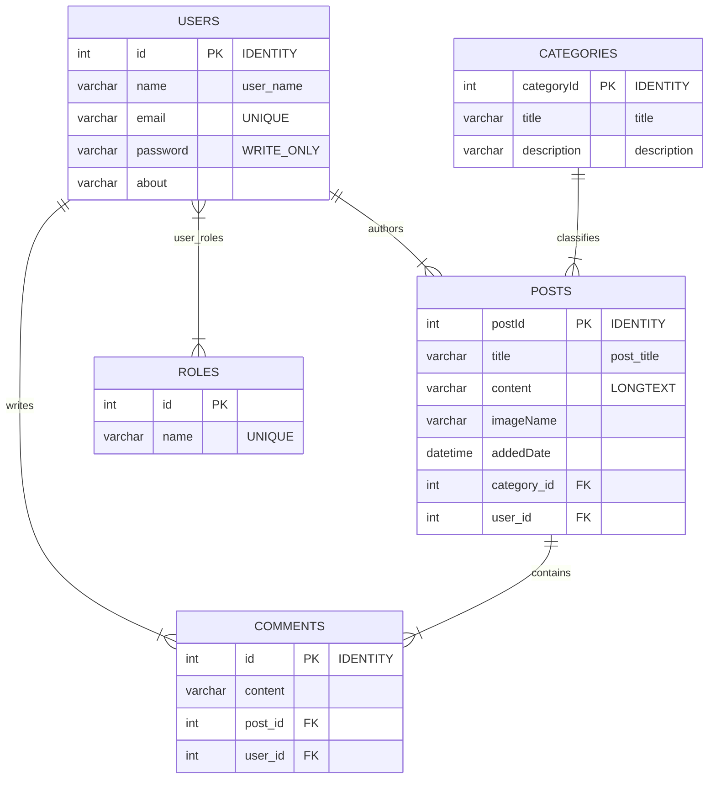

# Scribe API – Enterprise Blogging & Content Management Engine by Shivani Dubey

A high-performance, enterprise-grade RESTful content management API engineered with **Spring Boot 3**, **Java 23**, and **Spring Security**. This platform manages dynamic blogging lifecycles, role-based stateless JWT authorization, local filesystem media isolation, and transactional database persistence layers.

---

### 👤 About the Engineer

- **Name**: Shivani Dubey
- **Role**: Java Full Stack Developer (2.2+ Years Experience)
- **Core Stack**: Java 23, Spring Boot 3, Spring Security, Hibernate, MySQL, AWS, Postman
- **Connect**: [LinkedIn](https://linkedin.com/in/shivanis5) | [Email](mailto:work.shivanidubey@gmail.com)

---

## 📋 Functional Business Domain & Core Capabilities

Scribe API functions as the core engine for a modern, multi-author content publication platform. It provides a complete set of decoupled, role-guarded services that manage content lifecycles, user interactions, and catalog organization safely:

- **User Management & Authentication**: Handles registration, secure login, and user profile management, automatically assigning role privileges (`ROLE_NORMAL` / `ROLE_ADMIN`).
- **Content Management Lifecycle**: Allows authors to create, update, delete, and read rich-text blog posts supporting custom markdown headers and dynamic content updates.
- **Hierarchical Classification**: Organizes content using deep thematic categories, allowing users to filter and sort feeds by specific topics or interests.
- **Interactive Comments Subsystem**: Includes a thread moderation layer that lets authenticated users post feedback and comments on individual articles.
- **Media Processing Pipeline**: Integrates a dedicated image processing module that handles multi-part file uploads to dynamically attach cover images to blog entries.
- **Enterprise Feeds (Paging, Sorting & Searching)**: Implements server-side pagination, multi-field sorting algorithms, and dynamic keyword search operations to let users navigate massive content catalogs with minimal network overhead.

---

## 🏗️ Multi-Tier System Architecture & Request Lifecycle

The application enforces a decoupled, highly cohesive layered architecture pattern to isolate system boundaries, apply rigorous server-side validation filtering, and optimize database transactions:

```text
 [ Client Gateway ]     ▶ Web Clients | Swagger UI Dashboard | Postman Workspace
        │
        ▼ (HTTP Request Boundary Check)
 [ Security Layer ]     ▶ CORS Filter (Order -110) ──▶ Stateless JWT Filter (HMAC-SHA256)
        │
        ▼ (Authenticated Context Routing)
 [ Controller Tier ]    ▶ REST Controllers ──▶ Centralized Error Interceptor (@RestControllerAdvice)
        │
        ▼ (DTO Payload Transformation & Validation)
 [ Service Logic ]      ▶ Business Component Services ──▶ Password Hashing (BCrypt) | NIO File IO
        │
        ▼ (ACID Transaction Boundaries)
 [ Data Persistence ]   ▶ Spring Data JPA Repositories ──▶ Relational MySQL Instance
```

### 🔒 Enterprise Security & Filter Infrastructure

- **Pre-Flight CORS Isolation**: Cross-Origin Resource Sharing rules leverage a dedicated `FilterRegistrationBean`. Assigning an explicit processing execution priority order threshold (`-110`) guarantees that browser pre-flight checks (`OPTIONS` requests) are evaluated and resolved before hitting the Spring Security filter chain, preventing unexpected network blocking anomalies.
- **Cryptographic Identity Pipeline**: The token provider tier completely mitigates signature-tampering vulnerabilities by using an explicit, high-entropy 256-bit signing key vector (`Keys.hmacShaKeyFor`). The key negotiates signature verifications via standard modern JWT parser builders (`verifyWith()`), keeping credentials safe from legacy algorithm-switching attacks.
- **Granular Anonymous Gateway Strategy**: The `SecurityFilterChain` bean establishes structural accessibility rules across your endpoint ecosystem. It defines an immutable static pattern array (`PUBLIC_URLS`) to fully open Swagger UI dashboards, raw OpenAPI contracts, and statutory asset trees. This matches a custom path expression (`GET /api/v1/**`) to expose content streams freely while locking change actions behind token controls.

---

## 📊 Relational Database Data Model (ER Diagram)

This diagram details entity relationships, cascade behaviors, and foreign key boundaries mapping your relational database persistence layer.

_GitHub renders this native text-based model adaptively across dark and light display modes:_



---

## 📦 Advanced Data & Subsystem Engineering

### ⚡ N+1 Database Query Mitigation

- **Relational Fetch Tuning**: Structural repository-layer queries use explicit `JOIN FETCH` operations instead of lazy loading.
- **Transactional Efficiency**: Combines content, categories, and author profiles into unified database transactions, eliminating the performance bottleneck typical of Hibernate/JPA lazy loading.

### 📂 Directory Traversal Mitigation & File Isolation

- **Secure Path Separation**: File write operations are isolated entirely outside compiled target directories using safe, modern Java NIO API blocks (`Paths.get()`). By default, uploaded files are routed to `${user.home}/scribeapi/uploads/` to maintain clear separation between persistent media assets and compiled source binaries.
- **Collision Resistance**: The `FileServiceImpl` strips original client filenames and substitutes them with a securely generated, randomized `UUID` linked to a lowercase-normalized file extension before writing data directly to disk.

### 🛡️ Aspect-Oriented Request Sanitation & Error Normalization

- **Centralized Error Boundaries**: Centralized application exception management utilizes a global `@RestControllerAdvice` interceptor to capture all validation failures and data anomalies, completely removing messy try-catch boilerplate blocks from business services.
- **Granular Validation Payload Mapping**: Rejections caught via `MethodArgumentNotValidException` iterate through active binding streams (`FieldError`), extracting target property identifiers and matching error strings into a structured response envelope with an ISO-8601 timestamp.

---

## 🗺️ API Documentation & Verification Ecosystem

Technical recruiters and engineering managers can instantly explore, mock, and review system assets using these public documentation links and pre-configured workspace files:

- 🌐 **Interactive API Documentation:** [Explore Live Swagger UI](https://shivanidubeydev.github.io/scribe-api-backend/)
- 📊 **Relational Database Blueprint:** [View High-Res ER Diagram](./docs/diagrams/scribe_api_er.drawio.png)
- 🚀 **Automated Testing Suite:** [Download Postman Collection](./docs/postman/Scribe_API_Postman_Collection.json)

### ⚙️ Local Development Fallback Endpoints

If running this server natively on a local workstation machine, you can access internal endpoints directly here:

- Local Swagger Console: `http://localhost:8080/swagger-ui/index.html`
- Raw OpenAPI JSON Contract: `http://localhost:8080/v3/api-docs`

### 🚀 Postman Verification Workspace Workflow

To test role-guarded endpoints using your preferred API desktop clients:

1. Dispatch an unauthenticated `POST` request payload against `/api/v1/auth/login`.
2. Extract the string token value generated within the `token` element field of the response body.
3. Inject the value inside your request headers matching this key structural configuration parameter:
   ```text
   Authorization: Bearer <your_extracted_jwt_token_string>
   ```

---

## ⚙️ Environment Profile & AWS Cloud Deployment

### 1. Active Multi-Environment Configuration

The application decouples local parameters from cloud production deployment environments using isolated property targets:

- Local development profiles run on local MySQL clusters via: `spring.profiles.active=dev`
- Production environments target cloud architectures via: `spring.profiles.active=prod`

### 2. AWS Infrastructure Topology

The production deployment pipeline leverages a secure, highly scalable infrastructure topology deployed on **AWS (Amazon Web Services)**:

- **Compute Layer**: Packaged application `.jar` binaries deployed via **AWS Elastic Beanstalk**, ensuring automatic provisioning, load balancing, and auto-scaling.
- **Database Layer**: Migrated from local storage to a managed **Amazon RDS (MySQL Engine)** instance, isolating production records with restricted access controls.
- **Database Safeguard (`validate`)**: The production profile utilizes Hibernate `validate` configurations to block automatic schema modifications at runtime, preserving structural production data integrity.

### 3. Automated Programmatic Seeding

On application startup, the context delegates lookups to an idempotent `CommandLineRunner` initialization component. This safely verifies and injects essential security role metadata configurations (`501: ROLE_ADMIN` / `502: ROLE_NORMAL`) dynamically into your database layer using an `existsById()` check, completely avoiding duplicate data entries across container reboots or cloud scale-outs.

---

## 🛠️ Production Build Compiling & Execution Pipeline

To test, isolate, compile, and run the system binaries within local host systems or cloud infrastructure clusters, make use of the pre-packaged Maven automation scripts:

### 1. Execute Suite Unit-Tests

```bash
./mvnw clean test
```

### 2. Build Production Runnable Fat-JAR Binary

```bash
./mvnw clean package -DskipTests
```

### 3. Initialize Production Native Backend Daemon Server

```bash
nohup java -jar target/scribe-api-backend-0.0.1-SNAPSHOT.jar --spring.profiles.active=prod > server.log 2>&1 &
```

### 4. Monitor Runtime Diagnostic Application Logs

```bash
tail -f server.log
```
